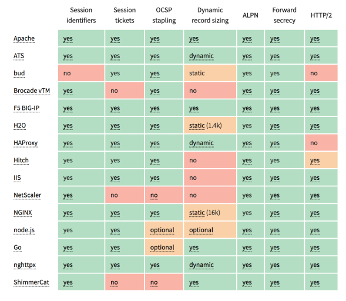

<h1>Чеклист производительности Front-End на 2017 </h1>

    Кто из Вас уже использует прогрессивную загрузку
    в своих проектах? А как насчет <strong>tree-shaking</strong> и <strong>code-splitting</strong> в React и
    Angular? Успели ли Вы настроить под себя сжатие Brotli или Zopfli, сшивание
    OCSP и сжатие HPACK? Не стоит ещё забывать
    о подсказках ресурсов, клиентских подсказках
    и сдерживании CSS — и это не говоря уже о IPv6, HTTP/2 и сервис воркерах.

    Давайте вспомним дни, когда производительность часто уходила на второй план.
    Дело доходило до неё аж в конце проекта, и в большинстве случаев это сводилось к
    минификации, конкатенации и оптимизации содержимого и, возможно, к паре
    дополнительных строк в конфигурационном файле сервера. Оглядываясь на те
    времена, понимаешь, что ситуация значительно поменялась с тех пор.
    Производительность касается не только технической стороны вопроса: она
    действительно важна, и нужно учитывать, как может отразиться на производительности
    то или иное решение ещё в момент создания дизайна. Производительность нужно
    постоянно замерять, отслеживать и улучшать, и вечнорастущая сложность
    веб-технологий всё чаще бросает разработчику вызов, делая невозможным
    отслеживание метрик, так как они будут значительно отличаться от устройства к устройству,
    от браузера к браузеру, будут зависеть от сетевого протокола, типа сети и
    задержки в ней (CDN-ы, ISP, кэши, прокси, фаерволы, балансировщики
    нагрузки и сами сервера играют большую роль в конечной производительности).

    Если бы Вам пришлось сделать обзор на все возможные технологии,
    с которыми придется встретиться в случае, если поставлена задача улучшить
    производительность Вашего сайта — от самого начала процесса и до
    финального релиза — на что бы Вы обратили своё внимание?
    Ниже приведён (надеюсь, беспристрастный и объективный)
    <strong>чеклист производительности front-end’а на 2017 </strong>— обзор
    всех тем, с которыми Вам возможно придется столкнуться для обеспечения
    максимально быстрого отклика и плавности работы Вашего вебсайта.
    (Вы также можете просто <a href="http://provide.smashingmagazine.com/performance-checklist/performance-checklist-1.0.pdf?_ga=1.67706521.905683373.1482741288"><strong>загрузить чеклист в PDF (ENG) (0.129 MB)</strong></a> ,
    <a href="https://github.com/FrontenderMagazine/front-end-performance-checklist-2017-pdf-pages/blob/master/Front-End%20Performance%20Checklist%202017.pdf"
       target="_blank"><strong>загрузить чеклист в PDF (RUS) (0.129 MB)</strong></a>
    или <a href="http://provide.smashingmagazine.com/performance-checklist/performance-checklist-1.0.pages?_ga=1.63331879.905683373.1482741288"><strong>скачать чеклист в формате Apple Pages (ENG) (0.236 MB)</strong></a>. Cчастливой оптимизации!)

<h1>
    Чеклист производительности Front-End’а в 2017
</h1>

    Текущие микро-оптимизации — это отличнный способ,
    чтобы удерживать Ваш продукт в строю, но гораздо
    важнее предопределить, какие цели стоят перед Вами, и
    не забывать о них, ведь они будут влиять на все решения, принимаемые 
    на протяжении всего процесса.
    Существует множество разнообразных моделей, и приведенные ниже могут варьироваться, 
    но главное ведь — расставить в своём проекте правильные приоритеты.

<h2>ГОТОВИМСЯ, СТАВИМ ЦЕЛИ </h2>
<h3>
    1. Будь на 20% быстрее ближайшего соперника.
</h3>

    По результатам психологического исследования оказалось, что если Вы хотите,
    чтобы пользователь ощущал, что Ваш вебсайт работает быстрее других, нужно быть как минимум
    на 20% быстрее. Не столь важно время полной загрузки и отображения страницы,
    как условные метрики, например, а ещё время начала рендера страницы,
    <a href="https://developers.google.com/web/tools/lighthouse/audits/first-meaningful-paint" target="_blank">первой
    значительной отрисовки </a> (к примеру, время, которое необходимо,
    чтобы страница отобразила свой основной контент) и
    <a href="https://developers.google.com/web/tools/lighthouse/audits/time-to-interactive" target="_blank">время интерактивности</a>
    (то есть время, необходимое странице, чтобы предоставить пользователю возможность взаимодействия с ней).
    Измерьте время начала рендера (с помощью
    <a href="http://www.webpagetest.org/" target="_blank">WebPagetest</a>)
    и время отображения первой
    значимой картинки (с помощью
    <a href="https://github.com/GoogleChrome/lighthouse" target="_blank">Lighthouse </a>) на  Moto G, на устройстве Samsung
    среднего уровня производительности и на добротном среднестатистическом устройстве,
    например Nexus 4, желательно
    в <a href="https://www.smashingmagazine.com/2016/11/worlds-best-open-device-labs/" target="_blank">открытой лаборатории девайсов</a> — на стандартных скоростях 3G,
    4G и при подключении к точке доступа Wi-Fi.

    
       <i><strong>Lighthouse</strong>, ПО для ревизии производительности от Google.</i>

    Обратите внимание на Вашу аналитику, чтобы определить, на чём концентрируются пользователи.
    Тогда Вы сможете сымитировать 90% пользовательского экспириенса синтетическим
    тестированием. Соберите информацию, составьте таблицу, сожмите её на 20%
    и таким образом определитесь со своими целями
    (например, с <a href="http://bradfrost.com/blog/post/performance-budget-builder/" target="_blank">бюджетом производительности</a>).
    Теперь у Вас есть что-то измеримое, на что можно ориентироваться в тестировании.
    Держа в голове мысль о бюджете производительности,
    и предпринимая попытки написания хоть малейшего скрипта
    для уменьшения времени интерактивности, Вы можете быть уверены,
    что Вы — на верном пути.

    
     
    <i><a href="http://bradfrost.com/blog/post/performance-budget-builder/" target="_blank">Билдер</a> бюджета производительности от Брэда Фроста.</i>

  <strong>
      Поделитесь чеклистом с коллегами.
  </strong>
    Удостоверьтесь, что каждый член Вашей команды ознакомлен с данным чеклистом, чтобы избежать возможного недопонимания в будущем. Каждое принятое решение имеет влияние на производительность, и проект будет только в выигрыше, если не только фронтендеры, но и UX и графические дизайнеры решатся следовать этому плану. Обозначьте решения дизайнера в бюджете производительности и расставьте приоритеты, о которых упоминалось выше.

<h3>
    2. Время отклика 100-миллисекунд, 60 кадров в секунду.
</h3>

    Модель производительности RAIL ставит перед Вами амбициозные цели:
    приложите все усилия и предоставьте пользователю отклик в течении
    100 миллисекунд после первого входа. Для создания возможности отклика
    <100 миллисекунд страница должна уступать управление главному потоку
    не позже, чем через каждые <50 миллисекунд. Для точек повышенной нагрузки — таких,
    как анимация, лучшим решением будет не нагромождать там, где есть такая возможность, а там, где её нет - обходиться самым минимумом.
    Более того, каждый кадр анимации должен сменяться менее чем
    за 16 миллисекунд, тем самым Вы достигнете заветных 60 fps
    (1 секунда ÷ 60 = 16.6 миллисекунд) —
    а ещё лучше – уложиться в пределы 10 миллисекунд.
    Вашему браузеру ведь нужно время, чтобы отрисовать новый кадр на экране,
    так что постарайтесь, чтобы исполнение Вашего кода завершилось
    в течение 16.6 миллисекунд.
    <a href="http://info.meteor.com/blog/optimistic-ui-with-meteor-latency-compensation" TARGET="_blank">Будьте оптимистом </a>и используйте время простоя с умом. Очевидно, что эта цель относится в большей степени к производительности во время выполнения, а не во время загрузки.

<h3>
    3. Первая значимая картинка через 1.25 секунды, индекс скорости меньше 1000.
</h3>

    Несмотря на сложность достижения, Вашей абсолютной целью должно быть
    начало отрисовки страницы уже через 1 секунду и значение
    <a href="https://sites.google.com/a/webpagetest.org/docs/using-webpagetest/metrics/speed-index" target="_blank">
        индекса скорости</a> менее 1000 (на высокоскоростном подключении).
    Максимально допустимая длительность отрисовки первого значимого изображения –
    1250 миллисекунд. Для мобильных устройств
    <a href="https://www.soasta.com/blog/google-mobile-web-performance-study/" target="_blank"> неплохим</a>
    показателем будет начало отрисовки страницы меньше, чем через 3 секунды для
    3G подключения. Если Ваши показатели слегка перевалили за это значение –
    ничего страшного, но старайтесь понизить эти показатели как можно сильнее.

<h2>
    ОПРЕДЕЛИМСЯ С ОКРУЖЕНИЕМ
</h2>
<h3>
    4. Выберите и сконфигурируйте инструменты сборки для себя.
</h3>

    Не стоит слишком зацикливаться на том, что считается трендовым инструментом в данный момент.
    Придерживайтесь в выборе собственных интересов в разработке,
    не важно, будет ли это Grunt, Gulp, Webpack, PostCSS или комбинация нескольких.
    До тех пор, пока Вам удается получать результат быстро,
    и Вы не ощущаете проблем в процессе использования инструментов сборки – у Вас должно быть всё хорошо.

<h3>
    5. Прогрессивное улучшение.
</h3>

    Смело делайте ставку на
    <a href="https://www.aaron-gustafson.com/notebook/insert-clickbait-headline-about-progressive-enhancement-here/" target="_blank">прогрессивное улучшение</a>
    в качестве ведущего принципа архитектуры вашего front-end’а. Сначала спроектируйте и реализуйте базовые возможности,
    и только потом дополняйте их сложными фичами для подходящих браузеров, создавая
    <a href="https://resilientwebdesign.com/" target="_blank">отказоустойчивый интерфейс</a>.
    В том случае, если Ваш вебсайт работает быстро на медленном устройстве
    со слабым браузером и посредственным интернетом, то Вы можете быть уверены, что он будет отлично
    работать на устройстве побыстрее, с современным браузером и хорошим интернет соединением.

<h3>
    6. Angular, React, Ember и компания.
</h3>

    Присмотритесь к фреймворку, который
    позволяет отрисовать картинку на стороне сервера.
    Не забудьте замерять время загрузки как в режиме отрисовки на сервере,
    так и на клиенте для мобильных устройств, прежде чем приступать
    к работе с фреймворком (так как эти изменения в будущем может быть
    невероятно сложно воплотить). Если Вы уже используете JavaScript фреймворк,
    убедитесь, что Ваш выбор является <a href="https://www.youtube.com/watch?v=6I_GwgoGm1w" target="_blank">оптимальным</a> и
    <a href="https://medium.com/@ZombieCodeKill/choosing-a-javascript-framework-535745d0ab90#.2op7rjakk">
    справедливым</a>. Каждый из фреймворков по-своему будет влиять на конечную производительность
    и будет требовать индивидуальной стратегии оптимизации, поэтому
    Вам нужно отчетливо понимать всю подноготную выбранного фреймворка.
    В процессе построения веб-приложения обратите внимание на
    <a href="https://developers.google.com/web/fundamentals/performance/prpl-pattern/" target="_blank">шаблон PRPL</a>
    и архитектуру
    <a href="https://developers.google.com/web/updates/2015/11/app-shell" target="_blank">оболочки приложения</a>.
    

    
       <i>PRPL отвечает за выгрузку критично важных ресурсов,
    Рендер изначальных маршрутов, пре-кэширование остальных маршрутов и lazy-load остальных маршрутов по запросу.</i>

    
     
    <i><a href="https://developers.google.com/web/updates/2015/11/app-shell" target="_blank">Оболочкой приложения</a> называют
        минимальный HTML, CSS и JavaScript, предоставляющий интерфейс пользователя.</i>

<h3>
    7. AMP от Google или Instant Articles от Facebook?
</h3>

    В зависимости от Ваших приоритетов и стратегии организации рабочего процесса, Вам предстоит выбирать между <a href="https://www.ampproject.org/" target="_blank">Google AMP</a> и <a href="https://instantarticles.fb.com/" target="_blank">Instant Articles</a> от Facebook. Конечно, Вы можете добиться отличной производительности и без них, но AMP, к примеру, предлагает фреймворк с превосходной производительностью и бесплатным доступом к СDN, а Instant Articles взвинтят показатели производительности на Facebook. Вы, кстати, можете и сами заняться построением
    <a href="https://www.smashingmagazine.com/2016/12/progressive-web-amps/" target="_blank">прогрессивных веб-приложений</a>.

<h3>
    8. Подойдите мудро к вопросу о выборе вашей CDN
</h3>

    В зависимости от того, насколько статична информация на вашем вебсайте,
    Вы можете попробовать вынести часть контента во
    внешний ресурс (<a href="https://www.smashingmagazine.com/2015/11/static-website-generators-jekyll-middleman-roots-hugo-review/" target="_blank">static site generator</a>),
    выгрузив ее на CDN и запрашивая оттуда статическую версию контента
    при необходимости, таким образом Вы спасётесь от запросов к базе данных.
    Вы даже можете выбрать для себя статические <a href="https://www.smashingmagazine.com/2015/11/modern-static-website-generators-next-big-thing/" target="_blank">
    хостинг-платформы </a> базирующиеся на CDN, обогащая страницы вашего вебсайта
    интерактивностью, в качестве прогрессивного улучшения
    (<a href="https://jamstack.org/">JAMStack</a>).
     
    Обратите внимание, что Вы можете использовать CDNы и для разгрузки (распределения)
    динамического контента. Так что не обязательно ограничиваться в использовании CDN только статическим контентом.
    Обязательно перепроверьте, выполняет ли выбранная CDN сжатие и преобразование контента, умную выгрузку HTTP/2, имеется ли возможность
    сборки статической и динамической части контента для страницы на стороне CDN’а (ближайший по расположению
    сервер для пользователя), и другие необходимые задачи.

<h2>
    ОПТИМИЗАЦИЯ СБОРКИ
</h2>
<h3>
    9. Установите для себя чёткие приоритеты.
</h3>

    Было бы мудро для начала ознакомитьсяю, с чем Вам придётся работать. Проведите «инвентаризацию» всех своих ресурсов и контента
    (JavaScript, изображения, шрифты, внешние скрипты, “увесистые” модули на странице, такие как карусели, сложная инфографика и мультимедийный контент),
    и разделите их на группы.
     
    Составьте таблицу. Определите <strong>основные моменты</strong> для устаревших
    браузеров (т. е. полностью доступный основной контент), затем
    <strong>улучшенный</strong> интерфейс для подходящих браузеров
    (т.е. улучшенный функционал, полный интерфейс взаимодействия) и
    <strong>дополнения</strong> (активы, которые не являются абсолютно необходимыми
    и могут быть подгружены позже (lazy-load),
    такие как веб шрифты, излишние стили, скрипты каруселей, видеоплейеры,
    кнопки социальных сетей, крупные изображения).
    В качестве примера рекомендуется к рассмотрению статья
    "<a href="https://www.smashingmagazine.com/2014/09/improving-smashing-magazine-performance-case-study/" target="_blank">Improving Smashing Magazine’s Performance</a>" , которая описывает этот подход в подробностях.

<h3>
    10. Используйте технику «Сбора вершков»
</h3>

    Что бы развернуть главную часть интерфейса в устаревших браузерах и
    добавить продвинутый функционал для современных браузеров — используйте
    технику <a href="http://responsivenews.co.uk/post/18948466399/cutting-the-mustard" target="_blank">«Сбора вершков»</a>. Чётко разделите
    процесс на стадии: выгрузите главную часть моментально,
    улучшения – по событию <code>DomContentLoaded</code> и прочие дополнения по событию <code>load</code>.
    Обратите внимание, что данная техника уменьшает зависимость
    производительности браузера от устройства, и это в наше
    время всё ещё имеет смысл. Например, в развивающихся странах
    дешевые смартфоны на Android в большинстве своём используют
    Chrome и смогут «собрать вершки» несмотря на их ограниченные память
    и возможности процессора. Знайте, что поскольку у нас с
    Вами нет альтернативы данной технике, её использование
    в последнее время стало более ограниченным.

<h3>
    11. Обратите внимание на микро-оптимизацию и прогрессивную загрузку.
</h3>

    Некоторым приложениям может понадобиться какое-то время, прежде чем
    Вы сможет отрендерить страницу. Гораздо лучшим решением будет
    показывать
    <a href="https://twitter.com/lukew/status/665288063195594752" target="_blank">скелет приложения</a>
    вместо индикаторов загрузки. Присмотритесь поближе к модулям
    и техникам по уменьшению
    скорости изначальной отрисовки страницы (например, <a href="https://medium.com/@richavyas/aha-moments-from-ngconf-2016-part-1-angular-2-0-compile-cycle-6f462f68632e#.8b9afnsub" target="_blank">tree-shaking</a> и
    <a href="https://webpack.github.io/docs/code-splitting.html" target="_blank">разделение кода</a>), потому что большая часть времени тратится именно
    на этом этапе на парсинг информации для приложения.
    Также используйте <a href="https://www.lucidchart.com/techblog/2016/09/26/improving-angular-2-load-times/">преждевременный компилятор</a>
    чтобы <a href="https://www.smashingmagazine.com/2016/03/server-side-rendering-react-node-express/" target="_blank">выполнить как можно более весомую </a>часть рендера на
    <a href="http://redux.js.org/docs/recipes/ServerRendering.html">сервере</a>
     и, следовательно, выведите используемые данные быстро.
    В конце концов возьмите на вооружение <a href="https://github.com/nolanlawson/optimize-js" target="_blank">Optimize.js </a>для
    ускоренной по средствам обертывания часто используемых функций
    загрузки (<a href="https://twitter.com/tverwaes/status/809788255243739136" target="_blank">это может быть и не нужно</a>).

     
    <i><a href="https://aerotwist.com/blog/when-everything-is-important-nothing-is/" target="_blank">
        Прогрессивная загрузка
    </a>
        подразумевает использование отрисовки страницы на сервере, чтобы получить первую значимую картинку максимально быстро,
        а также написание хоть минимального JavaScript, чтобы привести время интерактивности ближе ко времени отрисовки первой значимой картинки.
    </i>

    Рендер на клиенте или на сервере? В обоих случая нашей целью должно
    быть желание добиться <a href="https://aerotwist.com/blog/when-everything-is-important-nothing-is/" target="_blank">прогрессивной загрузки</a>:
    Используйте рендер на стороне сервера, чтобы получить первую значимую
    картинку как можно быстрее, а так же добавьте немного JavaScript’а, чтобы
    привести время интерактивности ко времени первой значимой картинки.
    А догрузить (или по запросу или когда позволит время) менее значимые
    функции страницы мы всегда успеем. К сожалению, как заметил
    <a href="https://aerotwist.com/blog/when-everything-is-important-nothing-is/#which-to-use-progressive-booting" target="_blank">Пол Льюис</a>, в
    большинстве своём фреймворки не берут во внимание понятие приоритетности,
    которое можно было бы использовать разработчику, и поэтому прогрессивную
    загрузку довольно сложно имплементировать с большинством библиотек и фреймворков.
    Если Вам позволяет время и ресурсы, используйте эту стратегию, чтобы достичь
    идеальной загрузки.

<h3>
    12. Правильно ли настроены HTTP заголовки?
</h3>

    Обязательно перепроверьте, что <code>expires, cache-control, max-age</code> и
    другие заголовки кэша HTTP правильно выставлены. В общем, ресурсы
    должны подлежать кэшированию или на очень короткий срок
    (если они могут изменяться) или навсегда (если они неизменны) —
    Вы можете просто изменять их версию в URL при необходимости.
    По возможности, используйте <code>Cache-control: immutable,</code>
    предназначенный для защищённых отпечатком пальца статических
    ресурсов, во избежание ре-валидации (на момент написания –
    Декабрь 2016 - поддерживается только в Firefox (supported only in Firefox)
    по транзакциям <code>https:// </code>). Вы можете использовать
    <a href="https://devcenter.heroku.com/articles/increasing-application-performance-with-http-cache-headers" target="_blank">
    праймер заголовков HTTP кэша Хироку </a>,
    <a href="https://jakearchibald.com/2016/caching-best-practices/" target="_blank">
    «Лучшие практики по кешированию» </a> Джейка Арчибальда
    и
    <a href="https://developers.google.com/web/fundamentals/performance/optimizing-content-efficiency/http-caching?hl=en" target="_blank">
    Праймер кэширования HTTP </a> от Ильи Григорика в
    качестве руководства.

<h3>
    13. Ограничьте сторонние библиотеки и загружайте JavaScript асинхронно.
</h3>

    Когда пользователь запрашивает страницу, браузер извлекает HTML и
    строит DOM, потом собирает CSS и строит CSSOM, и только потом генерирует
    дерево рендера в соответствии с DOM и CSSOM. Если какой-либо скрипт должен
    отработать по умолчанию, браузер не начинает рендер страницы, пока скрипт не
    закончит работу, что вызывает задержки рендера. Нам, разработчикам, приходится
    настойчиво указывать браузеру, что не стоит ждать окончания выполнения скриптов
    для начала рендера страницы. Простейшим способом добиться этого являются HTML
    атрибуты defer и async.
    На практике, хорошо бы нам отдавать <a href="http://calendar.perfplanet.com/2016/prefer-defer-over-async/" target="_blank">предпочтение </a><code>defer</code> перед
    <code>async</code> (как
    <a href="https://github.com/h5bp/lazyweb-requests/issues/42" target="_blank">
    поблажку для пользователей IE9</a> и старше, потому что скорее всего иначе Вы сломаете им все скрипты). Также
    постарайтесь ограничить влияние сторонних скриптов и библиотек, особенно кнопок
    социальных сетей и врезок <code>&ltiframe&gt</code> (карт, например). Вместо этого Вы можете
    использовать <a href="https://www.savjee.be/2015/01/Creating-static-social-share-buttons/" target="_blank">
    статические кнопки социальных сетей </a>
    (например, <a href="https://simplesharingbuttons.com/" target="_blank">SSBG</a>)
    и <a href="https://developers.google.com/maps/documentation/static-maps/intro" target="_blank">
    статические ссылки на интерактивные карты</a>.

<h3>
    14. Правильно ли оптимизированы изображения?
</h3>

    Как можно больше используйте <a href="https://www.smashingmagazine.com/2014/05/responsive-images-done-right-guide-picture-srcset/" target="_blank">адаптивные изображения</a> с атрибутами <code>srcset,
    sizes</code> и элементом <code>&ltpicture&gt</code>. Раз мы уже об этом заговорили, удостоверьтесь, что
    Вы используете <a href="https://www.smashingmagazine.com/2015/10/webp-images-and-performance/" target="_blank">
    WebP формат </a> для работы с изображениями тэга &lt picture &gt и резервным изображением
    в  JPEG ( <a href="https://dev.opera.com/articles/responsive-images/#different-image-types-use-case" target="_blank">
    смотреть пример кода </a>  Анрэаса Боуэнса) или используя заголовки Accept.
    Sketch нативно поддерживает WebP, и изображения в формате WebP могут
    быть экспортированы из Photoshop, используя <a href="http://telegraphics.com.au/sw/product/WebPFormat#webpformat" target="_blank">плагин WebP для Photoshop</a>.
    Конечно, <a href="https://developers.google.com/speed/webp/docs/using" target="_blank">
    возможны и другие варианты</a>.

      
    <i>
        <a href="http://www.responsivebreakpoints.com/" target="_blank">Генератор брейкпоинтов для адаптивных изображений </a>автоматизирует создание изображений и разметки.
    </i>

    Вы также могли бы использовать <a href="https://www.smashingmagazine.com/2016/01/leaner-responsive-images-client-hints/" target="_blank">
    клиентские подсказки</a>, они как раз сейчас
    <a href="http://caniuse.com/#search=client-hints" target="_blank">заручаются поддержкой браузеров</a>.
    Не успеваете заняться сложной разметкой для адаптивности Ваших изображений?
    Вам в помощь <a href="http://www.responsivebreakpoints.com/" target="_blank">Генератор брейкпоинтов для адаптивных изображений</a>
     а также другие сервисы автоматизированной оптимизации изображений,
    например <a href="http://cloudinary.com/documentation/api_and_access_identifiers" target="_blank">Cloudinary</a>. Также, в большинстве случаев использование одних
    только <code>srcset</code> и <code>sizes</code> принесёт значительную выгоду. Например, ребята из
    Smashing Magazine, используют <code>-opt</code> для имён изображений — например,
    <code>brotli-compression-opt.png</code>; Как только изображение содержит в себе
    постфикс opt, каждый член команды знает, что его уже не нужно оптимизировать.

<h3>
    15. Выведите оптимизацию изображений на новый уровень.
</h3>

    Когда Вы работаете над лэндингом, для которого критичным является молниеносная загрузка
    некоторых изображений, убедитесь, что Ваши JPEGи прогрессивны и сжаты с помощью <a href="https://github.com/mozilla/mozjpeg" target="_blank">mozJPEG</a>
    (который улучшает скорость начала рендера изображения с помощью манипуляций с
    уровнями сканирования), <a href="http://css-ig.net/pingo" target="_blank">
    Pingo</a> для PNG, <a href="https://kornel.ski/lossygif" target="_blank">Lossy GIF </a> для GIF и SVGOMG для SVG.
    Размойте ненужные части изображения (применяя к ним размытие по Гауссу), чтобы
    уменьшить размер, а если даже это не помогает, в конце концов можете
    попробовать лишать изображение цвета, черно-белое изображение весит гораздо меньше.
    Для фоновых изображений вполне приемлемым будет экспорт с качеством от 0 до 10%.
    Всё ещё не довольны результатом? Ну, тогда Вам придется обратиться к <a href="https://jmperezperez.com/medium-image-progressive-loading-placeholder/" target="_blank">технике
    множественных фоновых изображений</a>.

<h3>
    16. Как обстоят дела с оптимизацией веб-шрифтов?
</h3>

    Велик шанс, что в веб-шрифтах, которые Вы используете в
    своём проекте, присутствуют символы, которые Вы не используете.
    Вы могли бы попросить поставщика шрифтов сузить набор
    символов для ваших нужд или <a href="https://www.fontsquirrel.com/tools/webfont-generator" target="_blank">заняться этим самостоятельно</a>,
    если Вы используете открытые шрифты (например, включая в алфавит только некоторые символы из латиницы), чтобы уменьшить размеры файла.
     
    <a href="http://caniuse.com/#search=woff2" target="_blank">Поддержка WOFF2 </a> великолепна, а для
    подстраховки Вы можете использовать WOFF и OTF специально
    для браузеров с отстающей поддержкой. Также выберите для себя
    одну из стратегий Зака Лэзермана – <a href="https://www.zachleat.com/web/comprehensive-webfonts/" target="_blank">“Полное руководство
    по стратегиям загрузки шрифтов,” </a> а также используйте кэш
    сервис воркеров для постоянного кэширования шрифтов. Хотите
    быстрых результатов? У Pixel Ambacht есть <a href="https://pixelambacht.nl/2016/font-awesome-fixed/" target="_blank"> краткое исследование</a>
    вопроса (quick tutorial and case study), как привести Ваши
    шрифты в порядок.

    
     
    <i>
        <a href="https://www.zachleat.com/web/comprehensive-webfonts/"> “Полное руководство по стратегиям загрузки шрифтов,”</a>
        Зака Лэзермана предоставляет дюжену опций для улучшения выгрузки шрифтов/
    </i>

    Обязательно используйте <a href="https://github.com/typekit/webfontloader" target="_blank">Web Font Loader</a>, если Вам приходится
    использовать внешние сервера для загрузки шрифтов.
    <a href="https://www.filamentgroup.com/lab/font-events.html" target="_blank">FOUT лучше чем FOIT</a>; сразу же начните отрисовку текста
    и загрузите шрифты асинхронно — можете использовать
    <a href="https://github.com/filamentgroup/loadCSS" target="_blank"> loadCSS </a> для этих целей. Вы также можете <a
        href="https://www.smashingmagazine.com/2015/11/using-system-ui-fonts-practical-guide/" target="_blank">обойтись и шрифтами,
    установленными локально в ОС</a>.

<h3>
    17. Молниеносно выгрузите критичные CSS стили.
</h3>

    Чтобы быть уверенным на все 100%, что Ваш браузер начнёт
    рендер страницы настолько быстро, насколько это возможно,
    <a href="https://www.smashingmagazine.com/2015/08/understanding-critical-css/" target="_blank">общепринятой практикой </a>становится собирать
    весь необходимый для начала рендера первой видимой части
    страницы CSS (известный как «критично-важный» CSS) и добавлять его
    инлайново в <code> &lt head&gt </code> вашего документа, таким образом уменьшая
    запросы зависимости. Из-за ограничения на передачу пакетов во
    время медленной фазы ~ 14 KB это принято считать Вашим бюджетом
    критично важных CSS. Если Вы выйдете за рамки бюджета, браузер будет
    совершать дополнительные обращения, чтобы выгрузить больше стилей.
    <a href="https://github.com/filamentgroup/criticalCSS" target="_blank">CriticalCSS </a> и <a href="https://github.com/addyosmani/critical" target="_blank">Critical </a>
    позволяют Вам управится с задачей. Вам
    скорее всего понадобится проделать это с каждым шаблоном, над
    которым Вы работаете. Если возможно, постарайтесь использовать
    <a href="https://www.filamentgroup.com/lab/performance-rwd.html" target="_blank">условно-инлайновый подход</a>
    представленный Filament Group.
    С появлением HTTP/2, критично важный CSS можно хранить в
    отдельном файле CSS и выгружать по запросу с сервера с
    помощью сервер пуша, не загрязняя HTML. Загвоздка в том,
    что сервер пуш на данный момент не поддерживается и вызывает
    некоторые проблемы с кэшированием (слайд 114 <a href="http://www.slideshare.net/Fastly/http2-what-no-one-is-telling-you" target="_blank">презентации Хумана
    Бэхешти</a>). Результат может <a href="http://calendar.perfplanet.com/2016/http2-push-the-details/" target="_blank">быть негативным</a>, привести
    к загрязнению сетевых буферов и предотвращению доставки
    истинных пакетов. Сервер пуш гораздо более эффективен
    на <a href="https://docs.google.com/document/d/1K0NykTXBbbbTlv60t5MyJvXjqKGsCVNYHyLEXIxYMv0/edit" target="_blank">«тёплом» соединении</a> из-за медленного старта TCP.
    Так что Вам может понадобиться создать механизм <a href="https://css-tricks.com/cache-aware-server-push/" target="_blank"> HTTP/s
    сервер пуша, осведомленный о кэше</a>. Помните, что новая
    <a href="http://calendar.perfplanet.com/2016/cache-digests-http2-server-push/" target="_blank">спецификация <code>cache-digest </code> </a>снизит потребность
    в создании таких механизмов вручную.

<h3>
    18. Используйте tree-shaking и code-splitting для уменьшения нагрузки.
</h3>

    <a href="https://medium.com/@roman01la/dead-code-elimination-and-tree-shaking-in-javascript-build-systems-fb8512c86edf" target="_blank">Tree-shaking</a> — это способ расчистить ваш процесс
    сборки, вовлекая только ту часть кода, которая
    действительно используется на продакшене.
    Вы можете пользоваться <a href="http://www.2ality.com/2015/12/webpack-tree-shaking.html" target="_blank">Webpack 2, чтобы свести
    к минимуму ненужные экспорты кода</a>, и <a href="https://github.com/giakki/uncss" target="_blank">UnCSS </a>
    или <a href="https://github.com/geuis/helium-css" target="_blank">
    Helium</a>, чтобы предотвратить добавление в билд
    неиспользуемых стилей. Также Вы могли бы
    научиться <a href="http://csswizardry.com/2011/09/writing-efficient-css-selectors/" target="_blank">писать эффективные CSS селекторы</a>
    и избегать <a href="https://benfrain.com/css-performance-revisited-selectors-bloat-expensive-styles/" target="_blank">нагромождения весомых стилей</a>.
     
    <a href="https://webpack.github.io/docs/code-splitting.html">Code-splitting </a> — это ещё одна фича Webpack’а,
    которая разбивает основание кода на куски и
    подгружает по запросу. Как только
    Вы определите точки разделения вашего кода,
    Webpack сможет позаботиться о зависимостях
    и выходных файлах. Он, по сути, позволяет
    Вам удержать изначальный трафик в минимальном значении и
    запрашивать код при необходимости самим приложением.
    Примите к сведению, что <a href="http://rollupjs.org/" target="_blank">Rollup</a> показывает гораздо
    лучшие результаты, чем выдает Browserify.
    Раз уж мы заговорили от этом, вам может быть
    также интересен <a href="https://github.com/nolanlawson/rollupify" target="_blank">Rollupify</a>, который превращает
    модули ECMAScript 2015 в один большой CommonJS
    модуль — потому что маленькие модули могут
    требовать <a href="https://nolanlawson.com/2016/08/15/the-cost-of-small-modules/" target="_blank">на удивление больших затрат
    производительности</a> в зависимости от сборщика
    и модульной системы, которой Вы пользуетесь.

<h3>
    19. Улучшайте производительность рендера.
</h3>

    Изолируйте увесистые элементы с помощью политики <a href="http://caniuse.com/#search=contain" target="_blank">сдерживания CSS</a>
    — например, что бы ограничить стили браузера для компоновки и
    окраса элементов, для навигации вне канваса или для виджетов третьей стороны.
    Удостоверьтесь, что нет промедлений при прокрутке страницы и при анимации элементов,
    и что пользователь сможет получать стабильные 60 кадров в секунду. Если это не представляется
    возможным – как минимум предоставьте диапазон значений FPS в рамках 15-60. Используйте
    свойство CSS <code>will-change </code>, чтобы сообщить браузеру, какие элементы и свойства в будущем
    изменятся.  
    Также, <a href="https://aerotwist.com/blog/my-performance-audit-workflow/#runtime-performance" target="_blank">замерьте время производительности рендера </a>(например, в
    <a href="https://developers.google.com/web/tools/chrome-devtools/rendering-tools/" target="_blank">инструментах разработчика  </a>).
    Перед тем как приступить, пройдите бесплатный <a href="https://www.udacity.com/course/browser-rendering-optimization--ud860" target="_blank">курс на Udacity – отпимизация рендера браузером</a>.

<h3>
    20. "Разогрейте" соединение, чтобы ускорить загрузку.
</h3>

    Используйте скелетные экраны в интерфейсе и lazy load
    всех увесистых компонентов, например шрифтов, JavaScript, каруселей,
    видео и ifram’ов. Используйте <a href="https://w3c.github.io/resource-hints" target="_blank"> ресурсные подсказки</a>
    в целях сохранения времени на <code>dns-prefetch</code>
    (который выполняет DNS lookup в фоновом режиме), <code>preconnect</code>
    (который просит у браузера разрешение на начало рукопожатий
    (DNS, TCP, TLS – так же в фоне), <code>prefetch</code>(который просит браузер
    запрашивать ресурс), <code>prerender</code> (который указывает браузера как отрендерить
    страницу в фоновом режиме) и <code>preload</code> (который в том числе подготавливает
    ресурсы до взаимодействия с ними). Обратите внимание, что на практике в
    зависимости от поддержки браузера Вы скорее посмотрите в сторону <code>preconnect</code>
    чем <code>dns-prefetch</code>, и Вы, скорее всего, будете очень осторожны с <code>prefetch</code> и <code>prerender</code> — последний
    следует использовать только если Вы крайне уверены в том, как пользователь будет себя
    вести и каким будет его следующий шаг (хороший пример – воронка продаж).

<h2>
    HTTP/2
</h2>
<h3>
    21. Будьте готовы к HTTP/2.
</h3>

    Вместе с Google, <a href="https://security.googleblog.com/2016/09/moving-towards-more-secure-web.html" target="_blank">двигающимся в сторону
    более безопасного веба</a> и окончательного восприятия
    HTTP  страниц Chrome’ом как «небезопасные»,
    Вам придется решиться сделать ставку или на
    конфигурацию окружения <a href="https://http2.github.io/faq/" target="_blank">HTTP/2</a> или остаться на
    HTTP/1.1.  HTTP/2 <a href="http://caniuse.com/#search=http2" target="_blank">отлично поддерживается</a>;
    Он никуда не денется и в большинстве случаев лучше
    бы Вам принять его сторону. Безусловно, это
    достаточно трудоемкий процесс, но рано или
    поздно Вам придется перейти на HTTP/2.
    Когда Вы с этим покончите, вы получите
    <a href="https://www.youtube.com/watch?v=RWLzUnESylc&t=1s&list=PLNYkxOF6rcIBTs2KPy1E6tIYaWoFcG3uj&index=25" target="_blank"> отличный прирост в производительности </a>с
    сервис воркерами и сервер пушами.

    

    В итоге, Google собирается помечать все HTTP
    страницы как небезопасные и менять индикатор
    безопасности на этих страницах на красный треугольник,
    такой же, как сейчас у сломанных HTTPS.
    Отрицательный эффект такая миграция на HTTPS
    может возыметь в случае, если Ваша база пользователей
    HTTP/1.1 очень велика и большая часть из них
    использует устаревшие браузеры и операционные системы.
    В этом случае Вам придется отправлять разные сборки
    приложения, которые должны будут адаптироваться под
    <a href="https://rmurphey.com/blog/2015/11/25/building-for-http2" target="_blank">  разные процессы взаимодействия</a>.
    Помните: установка как миграции, так и новой сборки
    могут быть достаточно сложными и времязатратными.
    Для последующих частей статьи предположим, что
    Вы уже переключились на HTTP/2 или уже занимаетесь
    этим вопросом.

<h3>
    22. Правильно внедряйте HTTP/2.
</h3>

    и ещё раз, <a href="https://www.youtube.com/watch?v=yURLTwZ3ehk" target="_blank">обработка контента через HTTP/2</a> требует
    больших доработок и сильно отличается от того, как Вы обрабатывали ваши активы раньше.
    Вам придется найти баланс между упаковкой всех модулей в один и загрузкой множества
    мелких модулей параллельно.  
    С одной стороны, Вам может показаться хорошей идеей избежать сливания всех активов вместе,
    и вместо этого разделить весь Ваш интерфейс на множество маленьких модулей, сжимая и
    в процессе сборки, ссылаясь на них с <a href="https://rmurphey.com/blog/2015/11/25/building-for-http2">подходом «скаута»</a> и загружая
    их в параллели. В отличие от одного файла, в случае неудачной загрузки не придется
    выгружать полностью все стили и скрипты заново.  
    С другой стороны, <a href="http://engineering.khanacademy.org/posts/js-packaging-http2.htm" target="_blank">упаковка всех файлов в один </a>всё ещё имеет право на существование, потому что
    есть проблемы с отправкой множества маленьких JavaScript файлов в браузерах.
    Во-первых, <strong>пострадает сжатие</strong>. Компрессия больших файлов изменится в лучшую сторону
    благодаря повторному использованию словаря, что не касается отдельных небольших файлов.
    Ведется работа над улучшением этого момента, но это ещё далеко от реальности. Во-вторых,
    браузеры ещё не оптимизированы <strong>
    под такой ход работы
</strong> с файлами. Например, Chrome сочтет
    подобные изменения за <a href="https://www.chromium.org/developers/design-documents/inter-process-communication" target="_blank">межпроцессные коммуникации </a>
    между каждым из кластеров, поэтому включая сотни файлов Вы рискуете сильно проиграть в
    производительности.
    

    
     
    <i>

        Чтобы достичь лучших результатов используя HTTP/2, 
        попробуйте <a href="https://jakearchibald.com/2016/link-in-body/" target="_blank">подгружать CSS прогрессивно</a>,
        как было предложено Джеком Арчибальдом из Chrome.
        
    </i>

    Но Вы всё ещё можете попробовать <a href="https://jakearchibald.com/2016/link-in-body/" target="_blank">загружать CSS прогрессивно</a>.
    Очевидно, что поступая таким образом Вы будете активно ущемлять
    пользователей HTTP/1.1, так что Вам может понадобится генерация и
    обработка разных билдов для разных браузеров в процессе вашего деплоймента,
    и тут всё становится немного сложнее.
    Вы можете уйти от использования <a href="https://daniel.haxx.se/blog/2016/08/18/http2-connection-coalescing/" target="_blank"> HTTP/2 обьединяющим соединением</a>, что позволяет Вам использовать
    сегментирование доменов, чем значительно отличается от HTTP/2, но на практике достичь этого сложно.
    Так что же делать? Если Ваш вебсайт работает через HTTP/2, отправка около 10 сегментов является неплохим компромиссом (и это совсем не плохо даже для устаревших браузеров). Просто поэкспериментируйте и вычислите нужный баланс для Вашего вебсайта.

<h3>
    23. Удостоверьтесь в пуленепробиваемой защите вашего сервера.
</h3>

    Все браузерные реализации HTTP/2 работаю через TLS, так что скорее всего Вам захочется
    избежать оповещений безопасности или неработоспособности каких-то элементов на вашей странице.
    Перепроверьте, что <a href="https://securityheaders.io/" target="_blank">заголовки безопасности правильно настроены</a>,
    избавьтесь от <a href="https://www.smashingmagazine.com/2016/01/eliminating-known-security-vulnerabilities-with-snyk/" target="_blank">заранее известных
    уязвимостей</a> и проверьте <a href="https://www.ssllabs.com/ssltest/" target="_blank">Ваш сертификат</a>.
    Все ещё не перешли на HTTPS? Присмотритесь к <a href="https://https.cio.gov/faq/" target="_blank">HTTPS-Only Стандарту</a> в качестве инструкции.
 Также удостоверьтесь, что внешние плагины и отслеживающие скрипты загружены через HTTPS,
    что межсайтовый скриптинг невозможен и что как <a href="https://www.owasp.org/index.php/HTTP_Strict_Transport_Security_Cheat_Sheet" target="_blank">строгие заголовки транспортной безопасности </a>HTTP,
    так и <a href="https://content-security-policy.com/">заголовки политики безопасности подключений </a>заданы верно.

<h3>
    24. Поддерживают ли Ваш сервер и CDNы HTTP/2?
</h3>

    Разные сервера и CDNы скорее всего будет поддерживать
    HTTP/2 по-разному. Попробуйте <a href="https://istlsfastyet.com/" target="_blank">Is TLS Fast Yet?</a>
    Чтобы уточнить информацию касательно Вашего варианта или в сравнении
    с другими узнать насколько производителен Ваш сервер и поддержку каких фич
    стоит ожидать в скором времени.

      
    <i>Ресурс
        <a href="https://istlsfastyet.com/" target="_blank"> Is TLS Fast Yet?</a>
        Позволяет Вам проанализировать конфигурации серверов и CDN при переходе на
        HTTP/2.
    </i>

<h3>
    25. Используется ли сжатие Brotli или Zopfli?
</h3>

    В прошлом году Google <a href="https://opensource.googleblog.com/2015/09/introducing-brotli-new-compression.html" target="
">представили миру Brotli</a>, новый формат данных без потерь,
    который уже <a href="http://caniuse.com/#search=brotli" target="_blank">широко поддерживается </a>в Chrome, Firefox и Opera. На практике, Brotli
    представляется <a href="https://samsaffron.com/archive/2016/06/15/the-current-state-of-brotli-compression" target="_blank">более эффективным</a> чем Gzip и Deflate. Сам процесс
    сжатия может быть затяжным, в зависимости от настроек и чем дольше длится сжатие,
    тем выше будет уровень самого сжатия. Кстати говоря, декомпрессия происходит быстро.
    Не будет сюрпризом, что браузеры будут поддерживать этот алгоритм только если пользователь
    посещает вебсайт через HTTPS, ведь алгоритм разработан в Google, но на самом деле, на то
    есть ещё и технические причины. Загвоздка в том, что Brotli не предустановлен на большинстве
    серверов сегодня, и не так уж просто его настроить без самостоятельной компиляции NGINX или
    Ubuntu. Однако, Вы можете <a href="http://calendar.perfplanet.com/2016/enabling-brotli-even-on-cdns-that-dont-support-it-yet/" target="_blank">активировать Brotli </a> даже на тех CDN, которые пока что его не
    поддерживают(с помощью сервис воркеров).
    В качестве альтернативы можете рассмотреть <a href="https://blog.codinghorror.com/zopfli-optimization-literally-free-bandwidth/" target="_blank"> алгоритм сжатия Zopfli</a>, который кодирует информацию в форматы Deflate,
    Gzip и Zlib. Любой ресурс сжатый простым Gzip-ом можно выгодно сжимать с Zopfli’s
    с улучшеным кодированием Deflate, потому что файлы будут на 3-8% меньше, чем может
    предоставить лушчее сжатие от Zlib’s. Загвоздка в том, что это займет гораздо больше
    времени (~в 80 раз дольше). Поэтому использование Zopfli будет отличным решением для
    ресурсов, которые не очень-то меняются, и файлов, которые были созданы, чтобы однажды
    быть сжатыми и множество раз скачанными.

<h3>
    26. Активировано ли OCSP сшивание?
</h3>

    <a href="https://www.digicert.com/enabling-ocsp-stapling.htm" target="_blank">Включая сшивание OCSP </a>на своём сервере,
    Вы сможете значительно ускорить «рукопожатия» протокола
    TLS. Протокол OCSP (Online Certificate Status Protocol)
    был создан в качестве альтернативы для протокола CRL
    (Certificate Revocation List). Оба протокола используются
    для проверки валидности SSL сертификата. Однако, протокол
    OCSP не требует, чтобы браузер тратил время, загружая
    список сертификатов и детальную информацию про них для
    поиска, таким образом уменьшая время, затраченное на
    «рукопожатие».

<h3>
    27. Успели ли Вы взять IPv6 на вооружение?
</h3>

    Поскольку запасы адресов IPv4 <a href="https://en.wikipedia.org/wiki/IPv4_address_exhaustion" target="_blank">подходят к концу</a>,
    большинство мобильных сетей получают поддержку
    IPv6 просто молниеносно
    (США достигли порога в 50% поддержки IPv6),
    будет замечательной идеей обновить поддержку Вашего
    DNS на IPv6, чтобы
    в будущем обеспечить себе спокойный сон.
    Просто убедитесь, что во всей сети предоставляется
    двойной стэк – IPv4 и IPv6 — это позволит им
    работать одновременно бок о бок. Помните, IPv6
    не обратно-совместимый. Однако, исследования показали,
    что IPv6 сделал обычные сайты на 10-15%
    быстрее благодаря технике обнаружения соседа (NDP) и
    оптимизации маршрута.

<h3>
    28. Пользуетесь ли Вы HPACK сжатием?
</h3>

    В случае, если Вы используете HTTP/2, стоит убедиться,
    что Ваши сервера <a href="https://blog.cloudflare.com/hpack-the-silent-killer-feature-of-http-2/" target="_blank">используют сжатие HPACK </a>в заголовках HTTP
    ответов, чтобы уменьшить использование ресурсов.
    Из-за того, что сервера HTTP/2 относительно молоды,
    может иметь место неполноценная поддержка спецификаций,
    с HPACK, например. <a href="https://github.com/summerwind/h2spec" target="_blank">H2spec </a>это отличный
    (и очень детализированный) инструмент что бы проверить
    <a href="https://www.keycdn.com/blog/http2-hpack-compression/" target="_blank">работоспособность HPACK</a>.

    
     
    <i>
        H2spec
    </i>

<h3>
    29. Работают ли сервис воркеры для кэширования и сетевых фолбэков?
</h3>

    Как ни оптимизируй сетевую передачу данных, она не будет
    быстрее, чем получение данных из локального кэша, хранящегося
    на устройстве пользователя. Если Ваш вебсайт использует HTTPS,
    стоит присмотреться к <a href="https://github.com/lyzadanger/pragmatist-service-worker" target="_blank">«Прагматичному гиду по сервис воркерам»</a>,
     чтобы добавлять в кэш сервис воркеров статические
    материалы и локально хранить оффлайн фолбэки
    (или целые оффлайн страницы) и открывать их из памяти
    устройства пользователя, а не отправляться за ними в сеть.
    Будет полезным также посмотреть <a href="https://jakearchibald.com/2014/offline-cookbook/" target="_blank">«Книгу рецептов для Оффлайна»</a>
     и бесплатный Udacity курс от Джейка
    <a href="https://www.udacity.com/course/offline-web-applications--ud899" target="_blank">“Offline Web Applications.”</a> Волнуетесь о поддержке браузерами?
    Не стоит, <a href="http://caniuse.com/#search=serviceworker" target="_blank">она на подходе</a>, да и сеть в любом
    случае останется запасным вариантом.

<h2>
    ТЕСТИРОВАНИЕ И МОНИТОРИНГ
</h2>
<h3>
    30. Отслеживайте предупреждения микс-контента (mixed-content).
</h3>

    Если Вы не так давно перешли с HTTP на HTTPS,
    не забудьте промониторить предупреждения микс-контента,
    как активного так и пассивного, для этого подойдёт инструмент
    <a href="https://report-uri.io/" target="_blank">Report-URI.io</a>.
    Вы также можете использовать <a href="https://github.com/bramus/mixed-content-scan">
    Mixed Content Scan</a>
    что бы просканировать
    Ваш вебсайт с активированным HTTPS-на содержание микс-контента.

<h3>
    31. Оптимизирован ли Ваш рабочий процесс с Инструментами разработчика (DevTools)?
</h3>

    Выберите для себя инструменты отладки и прокликайте каждую кнопку,
    каждую ссылку. Убедитесь, что Вы знаете, как проанализировать и улучшить
    производительность отрисовки страницы, консольный вывод, и
    как отладить JavaScript или скорректировать CSS стили.
    Не так давно Умар Ганза (Umar Hansa)
    подготовил огромную <a href="https://umaar.github.io/devtools-optimise-your-web-development-workflow-2016/#/" target="_blank">презентацию</a> и <a href="https://www.youtube.com/watch?v=N33lYfsAsoU" target="_blank">речь</a>,
    в которых упоминаются дюжины неизведанных советов и техник,
    о которых не стоит забывать, когда дело доходит до отладки
    и тестирования в Инструментах разработчика (DevTools).

<h3>
    32. Какие результаты тестирования в устаревших браузерах? В прокси браузерах?
</h3>

    Тестирования в Chrome и Firefox, однозначно, недостаточно.
    Оцените, как Ваш вебсайт выглядит в прокси-браузере и в устаревших браузерах.
    К примеру, UC Browser и Opera Mini, <a href="http://gs.statcounter.com/#mobile_browser-as-monthly-201511-201611" target="_blank">
    занимают огромный сегмент рынка в Азии</a>
    (до 35%). <a href="https://www.webworldwide.io/" target="_blank">
    Исследуйте и замерьте</a> среднюю скорость подключения к сети в странах,
    на которые ориентирован Ваш продукт, чтобы в будущем не столкнуться с
    неприятным сюрпризом. Не забудьте провести тестирование с троттлингом и
    симулировать дисплей повышенной плотности.
    <a href="https://www.browserstack.com/" target="_blank">BrowserStack</a>  -
    это отличный инструмент, но тестирование на физических девайсах не менее важно.

<h3>
    33. Вы установили непрерывный мониторинг?
</h3>

    Всегда гораздо выгоднее иметь собственный экземпляр <a href="http://www.webpagetest.org/" target="_blank">
    WebPagetest
</a>'а для быстрого и неограниченного тестирования.
    Установите непрерывный мониторинг за бюджетом производительности с
    автоматическими извещениями. Установите собственные временные оценки,
    чтобы измерять, сравнивать и мониторить метрики в зависимости от сферы
    деятельности. Присмотритесь к использованию <a href="https://speedcurve.com/" target="_blank">
SpeedCurve</a> чтобы отслеживать изменения в производительности со временем, и/или
    <a href="https://newrelic.com/browser-monitoring" target="_blank">
        New Relic</a> что бы получить выводы, которые
    <i>WebPagetest</i> не предоставляет. Стоит так же обратить внимание на
    <a href="https://speedtracker.org/" target="_blank">SpeedTracker</a>,
    <a href="https://github.com/GoogleChrome/lighthouse" target="_blank">Lighthouse</a> и
    <a href="https://calibreapp.com/" target="_blank">Calibre</a>.

<h2>
    МОМЕНТАЛЬНЫЙ РЕЗУЛЬТАТ!
</h2>

    Список достаточно обширный, и выполнение оптимизации может отнять у Вас
    порядочно времени. А что, если бы у Вас был лишь 1 час, чтобы
    добиться значительных улучшений? Какое бы решение приняли Вы?
    Давайте сузим список до десятки самых легко достижимых целей.
    Очевидно, Вам придется замерять результаты до начала и после
    окончания оптимизации, включая время начала рендера и индекс скорости на 3G и проводном подключении.

<ol>
    <li>Вашей целью является начало отрисовки страницы не позже чем через
        1 секунду на проводном подключении и 3 секунды используя 3G, и
        значение индекса скорости менее 1000. Оптимизируйте время начала отрисовки и время интерактивности.</li>
    <li>Подготовьте критичный CSS для основны интерфейса и включите его в <code>
        &lthead&gt</code> вашей страницы. (Ваш бюджет - 14 KB).</li>
    <li>Используйте <i>Defer</i> и <i>lazy-load</i> во всех скриптах, где только возможно, как в своих собственных, так и в сторонних — особенно это касается социальных медиа ссылок, видеоплейеров, и увесистого JavaScript.</li>
    <li>Добавьте подсказки ресурсов, чтобы ускорить загрузки с быстрыми <code>dns-lookup, preconnect, prefetch, preload и prerender</code>.</li>
    <li>Разделите веб-шрифты и загружайте их асинхронно (или просто переключайтесь на системные шрифты, как альтернатива).</li>
    <li>Оптимизируйте изображения, рассмотрите возможность использования WebP для основных страниц (например, лэндингов).</li>
    <li>Удостоверьтесь, что сами заголовки кэша HTTP и их безопасность установлены правильно.</li>
    <li>Активируйте сжатие <i>Brotli</i> или <i>Zopfli</i> на сервере. (В случае если это невозможно, не забывайте про сжатие Gzip.)</li>
    <li>Если HTTP/2 доступен, активируйте сжатие HPACK и начните отслеживать предупреждения смешанного контента. Если Вы работаете над LTS, также активируйте сшивание OCSP.</li>
    <li>Если представляется возможным, кэшируйте содержимое, например шрифты,
        стили, скрипты и изображения, а вообще, чем больше – тем лучше — в кэше сервис воркеров.</li>
</ol>

<h2>
    Скачайте чеклист для себя (PDF)
</h2>

    Держа в голове этот чеклист, Вы гарантированно будете подготовлены
    к разработке любого front-end проекта в 2017 году.
    Не забудьте скачать PDF файл с чеклистом, подготовленным к печати для
    Ваших нужд:

<ul>
    <li><a href="http://provide.smashingmagazine.com/performance-checklist/performance-checklist-1.0.pdf" target="_blank">
        Download the checklist PDF </a></li>
    <li><a href="https://github.com/FrontenderMagazine/front-end-performance-checklist-2017-pdf-pages/blob/master/Front-End%20Performance%20Checklist%202017.pdf" target="_blank">
        Скачать чеклист в PDF на русском </a></li>
    <li><a href="http://provide.smashingmagazine.com/performance-checklist/performance-checklist-1.0.pages?_ga=1.131076231.905683373.1482741288" target="_blank">
    download the checklist а Apple Pages </a></li>
</ul>
<h1>
    Ну что ж, поехали!
</h1>

    Некоторая часть процесса оптимизации может выходить за рамки вашего проекта
    и/или бюджета, а также быть попросту невыполнимым заданием, работая,
    скажем, с доисторическим кодом, который Вам достался. Это вполне
    нормально! Рекомендуется использовать данный чеклист как общие
    (и, надеюсь, фундаментальные) инструкции, или создать на его
    основе свой собственный список тем, которые будут применимы для
    Вашего проекта. Кстати, не забывайте протестировать и замерить результаты
    Ваших проектов до начала оптимизации, чтобы определить наиболее важные моменты.
    Удачной всем оптимизации в новом, 2017 году!

